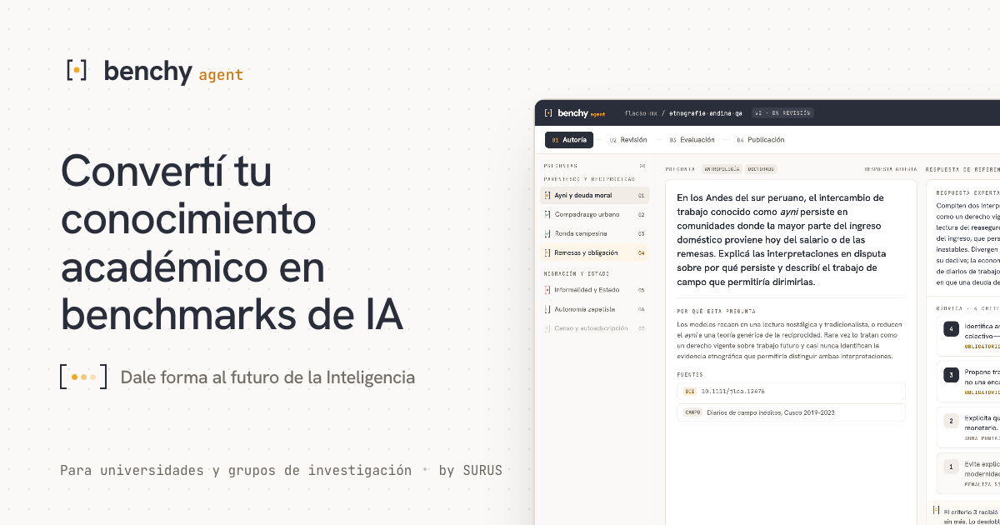

<p align="center">
  <a href="https://getbenchy.lat">
    
  </a>
</p>

<p align="center">
  <a href="https://getbenchy.lat">getbenchy.lat</a> ·
  <a href="https://getbenchy.lat/en">English</a> ·
  <a href="https://benchy.lat"><code>benchy::engine</code></a> ·
  <a href="https://surus.lat">by SURUS</a>
</p>

# Benchy Agent

**Convertí tu conocimiento académico en benchmarks de IA.**

Benchy Agent es la plataforma con la que universidades y grupos de investigación definen, generan y ejecutan sus propios benchmarks sobre [benchy::engine](https://benchy.lat): un agente que te ayuda a escribir el benchmark y una interfaz de autoría que trabaja sobre la misma definición explícita.

Evaluá a distintos modelos de IA. Identificá sus puntos ciegos, vulnerabilidades y sesgos, y construí los criterios que definirán lo que se viene.

> **Solo por invitación.** Mientras estamos en etapa temprana, el acceso se otorga por institución. Contanos sobre tu universidad y qué querés evaluar en [getbenchy.lat](https://getbenchy.lat/#access) y te enviamos las credenciales para tu grupo.

## Qué hace

1. **Definí tu benchmark.** Describís qué querés evaluar y el agente lo convierte en cuatro bloques explícitos: `programa`, `puntaje`, `datos` y `sistema-de-ia`. El agente y la interfaz de autoría escriben los mismos cuatro bloques: nada se infiere a tus espaldas.
2. **Generá el examen.** Datos sintéticos de benchmark a partir de tu contexto, restringidos y validados por la definición. Cada ítem se verifica antes de entrar al examen, así que las fallas de generación aparecen como rechazos y no como ruido silencioso en tus resultados.
3. **Sistemas de IA.** Evaluá lo que realmente ponés en producción: un modelo, un nodo de IA, un flujo de trabajo, un agente o un sistema de IA compuesto. El motor expone un único contrato de ejecución y se comunica con los sistemas mediante adaptadores.
4. **Ejecutá y puntuá.** El motor valida cada salida, puntúa cada dimensión de evaluación y produce el resultado del benchmark. Las salidas inválidas se registran, no se descartan.
5. **Explícito y reproducible.** Una sola definición YAML compartida por la persona, el agente y el motor. El benchmark se puede inspeccionar, versionar, reproducir y ejecutar sin estado oculto.

## Arquitectura

Monorepo [pnpm](https://pnpm.io):

| Ruta | Qué es |
|---|---|
| [`apps/web`](apps/web) | SPA con Vite + React (wouter, Tailwind). Landing pública (`/` en español, `/en` en inglés), ingreso (`/login`) y la aplicación (`/app`). Se sirve desde Cloudflare Pages; `functions/` proxyea `/api/*` al Worker por *service binding*. |
| [`apps/api`](apps/api) | Cloudflare Worker con Hono. Autenticación con [better-auth](https://better-auth.com) (magic link; Google preparado), invitaciones, intake público de "Solicitar acceso" protegido con Turnstile, mails con Cloudflare Email Sending. |
| [`packages/db`](packages/db) | Esquema Drizzle y migraciones para D1 (SQLite). |
| [`docs/`](docs) | Contrato de integración del backend, especificaciones de diseño y los handoffs visuales (landing, vista de plataforma, imagen OG). |

**Producción.** Cloudflare Pages (`getbenchy.lat`) → Worker `benchy-api` → D1 `benchy-db`, con Email Sending desde `getbenchy.lat` y Turnstile en el formulario público. Todo bajo un único origen: el navegador nunca habla con el Worker directamente.

**Identidad.** Usuarios reales de universidades, una organización por usuario, alta solo por invitación (emitida por CLI). Los benchmarks son visibles para toda la organización; las conversaciones con el agente son por usuario.

**Agente.** El agente conversacional corre sobre [Hermes Agent](https://github.com/NousResearch/hermes-agent), un contenedor por organización, con las habilidades centrales de Benchy administradas de forma centralizada y las habilidades propias de cada grupo editables por ellos. Está en construcción; el detalle vive en [`docs/backend-integration-contract.md`](docs/backend-integration-contract.md).

## Desarrollo local

Requisitos: Node 20 o superior y pnpm 10 (`corepack enable`). No hace falta cuenta de Cloudflare para desarrollar: el Worker y D1 corren en local con `wrangler dev`.

```bash
pnpm install

# API — Worker + D1 local
cat > apps/api/.dev.vars <<EOF
BETTER_AUTH_SECRET=$(openssl rand -base64 32)
GOOGLE_CLIENT_ID=placeholder
GOOGLE_CLIENT_SECRET=placeholder
TURNSTILE_SECRET_KEY=1x0000000000000000000000000000000AA
EOF
pnpm --filter @benchy/api db:migrate:local
pnpm dev:api        # http://localhost:8787

# Web — en otra terminal
pnpm dev:web        # http://localhost:21707, proxyea /api al Worker
```

`TURNSTILE_SECRET_KEY` y la `VITE_TURNSTILE_SITE_KEY` de `apps/web/.env` son las claves de prueba documentadas por Cloudflare: el desafío siempre pasa y no hace falta un widget real. `.dev.vars` está en `.gitignore`.

Pruebas:

```bash
pnpm test                                # Worker (auth, invitaciones, intake) + CLIs
pnpm --filter @benchy/api test           # solo el Worker: vitest sobre Miniflare con D1 real y migraciones aplicadas
pnpm --filter @benchy/api test:scripts   # solo las CLIs
pnpm --filter @benchy/web typecheck
```

## Operación

Las CLIs de administración hablan con la base de producción y requieren `wrangler login` con acceso a la cuenta:

```bash
pnpm access-requests                                   # solicitudes pendientes del formulario público (--all: todas)
pnpm invite --org "Universidad X" --email persona@universidad.edu
```

`invite` crea la organización si no existe, emite una invitación de 7 días, la envía por mail y marca la solicitud como `invited`. Una dirección solo puede ingresar si tiene una invitación pendiente o ya es usuaria: no hay registro abierto.

Despliegue:

```bash
pnpm deploy:api   # wrangler deploy → Worker benchy-api
pnpm deploy:web   # build + wrangler pages deploy → Pages benchy-agent (getbenchy.lat)
```

Secrets del Worker (`wrangler secret put`): `BETTER_AUTH_SECRET`, `GOOGLE_CLIENT_ID`, `GOOGLE_CLIENT_SECRET`, `TURNSTILE_SECRET_KEY`. Las variables públicas (`BETTER_AUTH_URL`, `EMAIL_FROM`, `OWNER_NOTIFY_EMAIL`) están en [`apps/api/wrangler.jsonc`](apps/api/wrangler.jsonc).

## Documentación

- [`docs/backend-integration-contract.md`](docs/backend-integration-contract.md) — el contrato entre la web, el Worker y el agente: topología, identidad y multi-tenancy, configuración de Hermes por organización, rutas del Worker, estado del despliegue.
- [`docs/superpowers/specs/2026-09-17-identity-multitenancy-design.md`](docs/superpowers/specs/2026-09-17-identity-multitenancy-design.md) — diseño de identidad, organizaciones e invitaciones.
- [`docs/design/`](docs/design) — handoffs de diseño: landing (EN + ES), vista de la plataforma (embeds HTML y script para regenerar las capturas), imagen OG y sistema de marca.

## Créditos

Benchy Agent es un proyecto de [SURUS](https://surus.lat). Cuenta con el apoyo de AWS como proyecto de impacto social: los créditos de cómputo y la infraestructura los provee Amazon Web Services, por lo que el acceso es gratuito para las universidades y los grupos de investigación con los que trabajamos.
